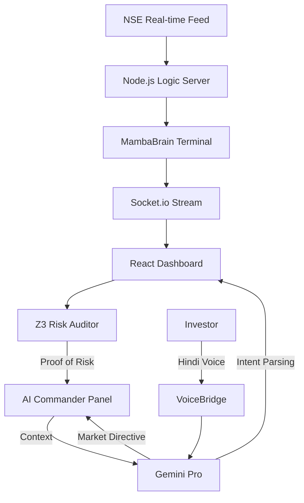

# BAZAAR BRAIN — ARCHITECTURE VISION 2026

## Executive Summary
Bazaar Brain is an **AI-Driven Risk Orchestration Dashboard** for the Indian Stock Market (NSE). Unlike traditional prediction tools, it prioritizes **Mathematical Certainty** and **Zero Hallucination** by combining Large Language Models (Gemini Pro) with Formal Verification (Z3 SMT Solver).

## The Tech Stack
- **Frontend**: React 19 + Vite (Ultra-fast HMR)
- **3D Visualization**: Three.js + React Three Fiber (R3F)
- **Logic Engine**: Node.js + Socket.io (Real-time data streaming)
- **AI Brain**: Google Gemini 2.5 Flash (Thinking Trace & Intent)
- **Risk Core**: Z3 SMT Solver (Formal proof-of-safety)
- **Voice**: Web Speech API (Hindi-first commands)
- **Thinking**: Native `thinkingConfig` API for verifiable reasoning steps

## System Architecture

## Key Innovations

### 1. The Z3 Risk Auditor
The "Proof Engine" doesn't guess. It translates market conditions into logical formulas:
- IF `Sector_Tension > 0.85` AND `Volume_Spike > 2.0x`
- AND `Z-Score_Variance > 2.5`
- THEN `ASSERT UNSAFE`
The AI only speaks *after* the proof is generated.

### 2. MambaBrain Terminal
A centralized data controller that manages "Simulation Mode" vs "Live NSE Mode", allowing for high-fidelity demo sequences without waiting for market volatility.

### 3. Hindi Voice Semantic Layer
A custom-built intent parser using Gemini to map natural Hindi speech ("Pharma sector dikhao") to dashboard actions, making the tools accessible to the next 100M Indian investors.

### 4. Resilient Data Waterfall (Tier 1-3)
To ensure zero-downtime during high-stakes demonstrations, Bazaar Brain implements a 3-tier data redundancy architecture:
- **Tier 1: NSE Official** — Real-time index data fetched via CSRF-handshake from nseindia.com.
- **Tier 2: Yahoo Finance** — Sub-second fallback for global market parity.
- **Tier 3: Micro-Jitter Cache** — If both APIs fail (e.g., weekend or rate limits), the server maintains a state-space simulation with +/- 0.05% realistic volatility to keep the Z3 Auditor active.

### 5. Sentinel: Cross-Sector Contagion Prediction
Sentinel is a **temporal correlation engine** that monitors the lead-lag relationship between sectors.
- **Logic**: It computes a rolling 20-tick Pearson correlation matrix of sector stress levels.
- **Action**: If `corr(A, B) > 0.85` and Sector A's tension trend accelerates, Sentinel fires a "Pre-Shock" warning for Sector B.
- **Goal**: Transition from *reactive* auditing to *predictive* risk mitigation.

---
*Created for ET GenAI Hackathon 2026. Built by Brains, Verified by Math.*
